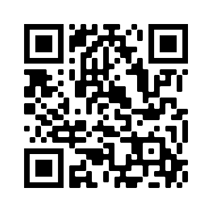
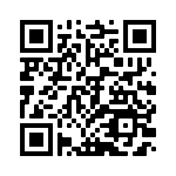

# VR_GoogleTours_Teaching

Virtual reality has great potential to engage the student, especially in remote learning, through the creation of simple tours.

This GitHub contains sample virtual reality tours that can be viewed even on a device as simple as google cardboard.

Tour 1. is a tour of the Colorado Confluence that was used to teach Geology 101. 
Click this link to go to tour: https://poly.google.com/u/1/view/4-RegHasujt

Or scan this QR code:

Tour 2. is a tour of Layatte College Mechanical Engineering Labs. 
Click this link to go to tour: https://poly.google.com/u/1/view/c6CU-83Kv5G

Or scan this QR code:

